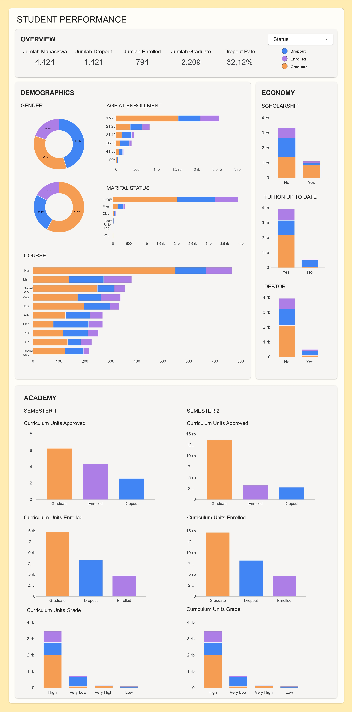

# Proyek Akhir: Menyelesaikan Permasalahan Perusahaan Edutech

## Business Understanding
Jaya Jaya Institut merupakan salah satu institusi pendidikan perguruan yang telah berdiri sejak tahun 2000. Hingga saat ini ia telah mencetak banyak lulusan dengan reputasi yang sangat baik. Akan tetapi, terdapat banyak juga siswa yang tidak menyelesaikan pendidikannya alias dropout.

Jumlah dropout yang tinggi ini tentunya menjadi salah satu masalah yang besar untuk sebuah institusi pendidikan. Oleh karena itu, Jaya Jaya Institut ingin mendeteksi secepat mungkin siswa yang mungkin akan melakukan dropout sehingga dapat diberi bimbingan khusus.

### Permasalahan Bisnis
- **Tingginya angka mahasiswa yang dropout:** Jaya Jaya Institut ingin meningkatkan kualitas institusi dengan menekan jumlah mahasiswa yang berhenti sebelum lulus.
- **Kebutuhan deteksi risiko lebih awal:** Jaya Jaya Institut memerlukan pendekatan analitik berbasis data untuk mengidentifikasi mahasiswa yang berpotensi dropout sejak dini agar dapat dilakukan intervensi.
- **Kebutuhan visualisasi data untuk pengambilan keputusan:** Jaya Jaya Institut membutuhkan dashboard interaktif yang dapat menampilkan kondisi dan pola akademik mahasiswa sebagai dasar dalam pengambilan kebijakan.

### Cakupan Proyek
- Business Understanding: Memahami permasalahan utama terkait tingginya angka mahasiswa yang tidak menyelesaikan studi serta kebutuhan institusi dalam melakukan deteksi dini
- Persiapan dan pengolahan data: Melakukan proses transformasi data agar siap digunakan dalam analisis dan pemodelan
- Modeling: Membangun model untuk memprediksi status mahasiswa
- Evaluation: Menilai performa beberapa model untuk menentukan pendekatan terbaik dalam prediksi
- Deployement: Mengimplementasikan model agar dapat digunakan untuk melakukan prediksi
- Dashboard: Menyajikan hasil analisis dalam bentuk visual interaktif
- Business Insight: Menarik kesimpulan dari hasil analisis dan memberikan rekomendasi
- 
### Persiapan

**Sumber data:** [Student's Performance](https://github.com/dicodingacademy/dicoding_dataset/tree/main/students_performance)

**Setup environment:**
1. Clone Repository
```
git clone https://github.com/evitamyn/Beijing-Air-Quality.git
```
2. Buat Environment
```
conda create --name main-ds python = 3.13.9 
conda activate main-ds
```

3. Install Packages
```
pip install -r requirements.txt
```

3. Jalankan Streamlit
```
streamlit run app.py
```


## Business Dashboard
Dashboard ini dibuat untuk memberikan gambaran cepat dari hasil analisis data mahasiswa yang mencakup berbagai aspek, seperti demografis, ekonomi, dan akademik. Informasi ini membantu institusi dalam memahami pola mahasiswa, mengidentifikasi faktor risiko dropout, serta mendukung pengambilan keputusan berbasis data.
[Link Dashboard](https://datastudio.google.com/reporting/1a748715-379e-4c77-ada5-aa93980c114f)


## Menjalankan Sistem Machine Learning
Prototype sistem machine learning dapat dijalankan secara lokal dengan cara
```
streamlit run app.py
```
atau dijalankan melalui link berikut: [Link Prototype](https://studentsperformance-prediction.streamlit.app/)

Dengan memasukkan data mahasiswa pada form input yang disediakan, sistem akan memproses input tersebut menggunakan model yang telah dilatih dan menghasilkan prediksi status mahasiswa (Dropout, Enrolled, atau Graduate).

## Conclusion
1. Permasalahan dropout di Jaya Jaya Institut sebesar 32,1% merupakan angka yang perlu ditindak lanjuti. Hal ini disebabkan oleh beberapa faktor berikut:
- **Faktor Akademik**
  Akademik merupakan faktor terkuat dalam permasalahan ini. Performa di tahun pertama (Semester 1 & 2) adalah penentu mutlak. Selain itu, rendahnya nilai akademik serta sedikitnya keterlibatan mahasiswa dalam evaluasi akademik juga berkaitan dengan tingginya risiko dropout. Hasil feature importance menunjukkan bahwa curricular units approved dan enrolled pada semester awal menjadi faktor paling penting dalam prediksi dropout mahasiswa.

- **Faktor Ekonomi**
  Masalah ekonomi pribadi yang dialami oleh mahasiswa seperti tunggakan biaya kuliah cenderung memiliki risiko dropout yang lebih tinggi dibandingkan mahasiswa yang pembayaran kuliahnya lancar. Sedangkan masalah ekonomi negara tidak berpengaruh pada alasan mahasiswa dropout. Namun, beasiswa dapat dikatakan menjadi alasan mahasiswa bertahan. 

- **Faktor Demografis**
  Mahasiswa dengan karakteristik tertentu memiliki kecenderungan dropout yang lebih tinggi, seperti mahasiswa yang mendaftar pada usia lebih tua, mahasiswa kelas malam, mahasiswa yang sudah menikah. Selain itu, beberapa program studi seperti Basic Education dan Social Service menunjukkan tingkat dropout yang lebih tinggi. Latar belakang pekerjaan orang tertentu dan jalur pendaftaran internasional juga ditemukan berkaitan dengan risiko dropout mahasiswa.

2. Model terbaik adalah Logistic Reggresion dengan
   - Accuracy: 0.91
   - Precision: 0.90
   - Recall: 0.87
   - F1 Score : 0.88
   Hasil ini menunjukkan bahwa model mampu melakukan prediksi dropout dengan baik dan dapat digunakan sebagai sistem deteksi dini mahasiswa yang berisiko dropout.


### Rekomendasi Action Items
Rekomendasi action items yang harus dilakukan perusahaan guna menyelesaikan permasalahan atau mencapai target mereka, yaitu
- **Intervensi akademik dini:** Memberi bantuan belajar untuk mahasiswa yang nilainya rendah di awal semester.
- **Dukungan finansial:** Menambah bantuan biaya atau beasiswa untuk mahasiswa yang kesulitan ekonomi.
- **Sistem peringatan dini:** Membuat sistem untuk mendeteksi mahasiswa yang berisiko dropout lebih awal.
- **Pendampingan khusus:** Memberi perhatian lebih pada kelompok mahasiswa yang lebih rentan dropout.
- **Perbaikan awal perkuliahan:** Menyesuaikan beban mata kuliah di semester awal agar lebih mudah diikuti.
- **Optimasi beasiswa:** Memastikan beasiswa benar-benar membantu mahasiswa tetap bertahan sampai lulus.
